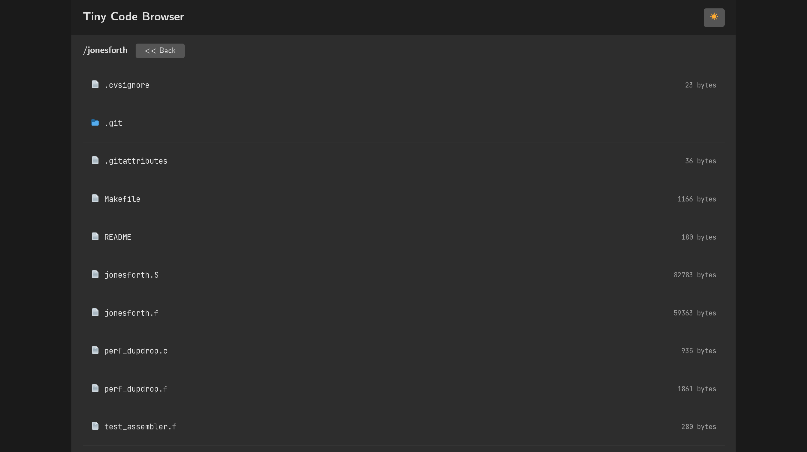

# Tiny Code Browser

A lightweight web-based file browser designed for reading code on any device. No installation required on client devices - just point your browser at the server.

I built this because I wanted to read code on my tablet without dealing with file transfers or finding apps that don't suck for code viewing. Specifically wanted to read jonesforth source code while lounging around, and copying files to the tablet + finding a decent text viewer was more annoying than just writing this.

## Screenshots

**Directory listing**



**File viewing**


## Features

- Clean, responsive web interface
- Dark/light theme toggle
- Adjustable font sizes
- Monospace font for code reading
- Directory browsing
- File size display


## Running with Docker

### Using Docker Compose

```bash
git clone <repository>
cd tiny-code-browser
mkdir files
# Copy your code files to ./files/
docker-compose up -d
```

### Using Docker Directly

```bash
docker build -t file-browser .
docker run -p 8080:8080 -v /path/to/your/code:/srv file-browser
```

Open http://localhost:8080 in your browser.

## Building from Source

### Prerequisites
Just the Go compiler. Tested with v1.24.6. 
Should probably compile fine with older versions, just change the `go.mod` file as needed.

### Build and Run
```bash
git clone <repository>
cd tiny-code-browser
go mod tidy
go build -o file-browser
./file-browser
```

## Configuration

Configure via environment variables:

| Variable | Default | Description |
|----------|---------|-------------|
| `ROOT_DIR` | `./srv` | Directory to serve files from |
| `LISTEN_ADDR` | `0.0.0.0:8080` | Address and port to listen on |
| `APP_TITLE` | `Tiny Code Browser` | Application title shown in browser |

### Examples

```bash
# Serve files from /home/user/code on port 3000
ROOT_DIR=/home/user/code LISTEN_ADDR=0.0.0.0:3000 ./file-browser

# Custom title
APP_TITLE="My Code Library" ./file-browser
```

## Docker Configuration

### docker-compose.yml
```yaml
version: '3.8'
services:
  file-browser:
    build: .
    ports:
      - "8080:8080"
    volumes:
      - ./files:/srv
    environment:
      - APP_TITLE=My Code Browser
    restart: unless-stopped
```

### Docker Run Examples
```bash
# Basic usage
docker run -p 8080:8080 -v /path/to/code:/srv file-browser

# Custom configuration
docker run -p 3000:3000 \
  -v /home/user/projects:/srv \
  -e APP_TITLE="Project Browser" \
  -e LISTEN_ADDR=0.0.0.0:3000 \
  file-browser
```

## Security Notes

- The application serves files read-only
- Path traversal protection prevents access outside the configured root directory
- No authentication is built-in - use a reverse proxy if you need access control

## License

MIT License
